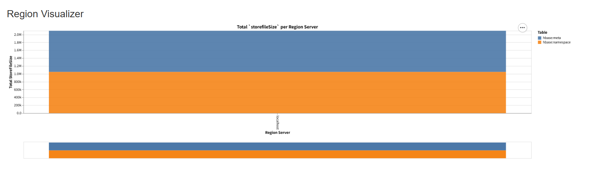

# Hbase
- 컬럼 기반 데이터데이스 (NoSQL)
    - 갖고있는 컬럼의 갯수만큼 오른쪽으로 무한히 확장
    - 비어있는 컬럼이 있어도 괜찮음
- 구글의 빅테이블을 모델로 하여 만들어짐
- 중간에 데이터를 추가, 추가하면서 정렬됨 => 비슷한 데이터끼리 뭉쳐짐

## install
- `damf2/hbase`폴더 생성
- [download](https://hbase.apache.org/downloads.html) => 최상단(`~`)에 설치
```shell
wget https://dlcdn.apache.org/hbase/2.5.11/hbase-2.5.11-hadoop3-bin.tar.gz
```
- unzip => 생성된 폴더 이름 `hbase-2.5.11`으로 변경
```shell
tar -zxvf hbase-2.5.11-hadoop3-bin.tar.gz
```
- `.bashrc`
```bashrc
export JAVA_HOME=/usr/lib/jvm/java-8-openjdk-amd64
export HADOOP_HOME=/home/ubuntu/hadoop-3.3.6
export HIVE_HOME=/home/ubuntu/hive-3.1.3
export HBASE_HOME=/home/ubuntu/hbase-2.5.11

export PATH=$PATH:$HADOOP_HOME/bin:$HIVE_HOME/bin:$HBASE_HOME/bin
```
- config `$HBASE_HOME> conf > hbase-site.xml`
```xml
  <property> <!--밑에 추가-->
    <name>hbase.wal.provider</name>
    <value>filesystem</value>
  </property>
```
- `hadoop-3.3.6/sbin/start-all.sh` : 하둡 실행
- `hbase-2.5.11/bin/start-hbase.sh` : hbase 실행
- `localhost:16010` -> hbase 실행
- `sudo vi /etc/hosts`에 `127.0.0.1    1-13`추가
- `hbase-2.5.11/bin/stop-hbase.sh` 멈췄다가 다시 실행
- `hbase-2.5.11/bin/start-hbase.sh`\
=> 밑에 사진처럼 뜨면 잘 실행된 것(시간이 좀 걸림)


## hbase command
### shell 실행
```shell
source ~/.bashrc
hbase shell
```

### create
```shell
# 테이블 생성
create 'students', 'info'

# 확인
list

# 테이블에 데이터 생성
put 'students', '1', 'info:name', 'hong'
put 'students', '1', 'info:age', '20'
put 'students', '2', 'info:name', 'kim'
put 'students', '2', 'info:address', 'seoul'
```
### read
```shell
# 하나의 데이터 조회
get 'students', '1'
get 'students', '2'

# 전체 데이터 조회
scan 'students'
```
### update
```shell
put 'students', '1', 'info:age', '30'
get 'students', '1'
```
### delete
```shell
# 해당 컬럼 삭제
delete 'students', '2', 'info:address'
get 'studnets', '2'

# 전체 컬럼 삭제
deleteall 'students', '1'
get 'students', '1'
```
### drop table
```shell
disable 'students'
drop 'students'
list # => 0개의 행을 가진 빈 테이블
```