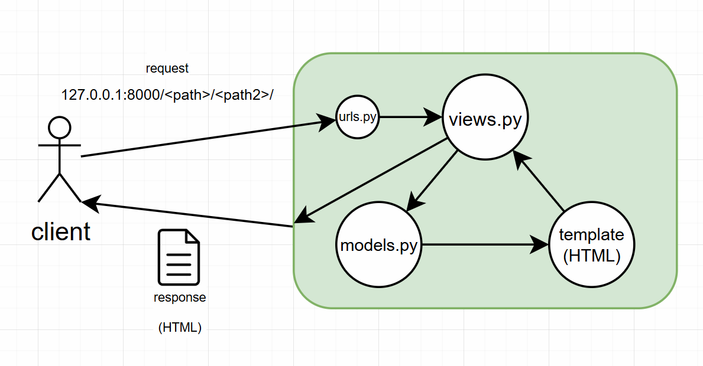

# 장고(django)
- [django](https://docs.djangoproject.com/en/5.1/intro/tutorial01/)
-  웹 프레임워크 - 챗봇 만들 때 사용한 fastAI도 웹 프레임워크임
- MVC(model(데이터)-view(보여지는 것, html)-controller(동작, python)) => 장고에서는 MTV(model-tamplate-view)라 부름, MVC랑 똑같음
    - 코드를 어떻게 넘겨주고 넘겨받고 보여지는지
    - 소프트웨어 디자인 패턴
    - model(데이터) : 표에 정보(데이터) 저장
    - template(템플릿, html) : 저장한 정보가 어떻게 표시되는지 정의
    - view : 중간 관리자 역할, 보여주기 위한 표들이 있는 공간

# setting
- `python -m venv vnev`
- `source venv/Scripts/activate`
- `pip install django` : 가상환경 활성화된 상태에서 설치
- `.gitignore` 설정

# [django](https://github.com/dahee325/first_pjt)
## faker 라이브러리 설치
- 가상의 문장, 단어, 날짜 등을 설정한대로 출력해주는 라이브러리
- `pip install faker`

## 프로젝트 생성
- `django-admin startproject <pjt-name> <path>`\
=> `django-admin startproject first_pjt .` : django가 설치된 상태에서 이름이 `first_pjt`인 프로젝트를 현재 위치에서 시작 => `first_pjt` 폴더(5개의 파일)와 `manage.py`파일을 만들어줌
- `manage.py` : 터미널창에서 장고한테 명령어를 내릴 떄 사용하는 파일
- `__init__.py` : 모듈로 동작할 수 있도록 만들어주는 파일
- `settings.py` : 각종 장고 설정(시간, 데이터베이스)
- `urls.py` : 어떤 요청이 들어왔을 떄 views.py안의 데이터와 연결

## 서버 실행
- `python manage.py runserver` => 종료 `ctrl + c`
- 서버가 계속 돌아가고있음 => 내가 해당하는 주소로 누가 불러줄 때까지 계속 기다림
- http://127.0.0.1:8000/
    - 127.0.0.1 : 내 컴퓨터에서 돌아가는 주소
    - 8000 : 포트(개발서버들은 보통 8000 포트, http는 80포트, https는 443포트 사용)

## 앱 생성/등록
- `django-admin startapp <app-name>` : 경로 설정을 하지 않으면 현재 폴더에 자동으로 생성(=`python manage.py startapp <app-name>`)\
=> `django-admin startapp first_app`
- `first_app.setings.py`에서 **앱 등록**
```python
INSTALLED_APPS = [
    ...,
    '<app-name>',
]
```

1. `urls.py` : 어떤 경로를 받을지 설정, 실행하고싶은 기능의 영어철자를 사용하는게 일반적 => 보자마자 url이 어떤 기능을 할지 예측 가능해야함
2. `views.py` : 실행시키고싶은 함수를 모아놓은 파일 => 함수의 이름은 경로 이름과 같게 설정
3. `.html` : 사용자가 보는 형태를 적은 파일
tab(자동완성)이 안되면 우측 하단에 html로 되어있는지 확인 => django로 되어있으면 html로 바꿔야함

- 경로설정(`urls.py`) => 기능구현(`views.py`) => `templates/0000.html`(html은 정적인 파일)
- 동적으로 만들기
    - views.py파일 안의 함수 안에 context={키:값,}만들고 return render()에 인자로 context추가
    - `.html`파일의 안에 {{딕셔너리 키값}}을 포함하는 태그 작성
    - {{context의 키}} : django안의 `render()`가 만들어주는 함

## 경로설정 변수화(variable routing)
- `urls.py` 파일에 `path('profile/<username>/', views.profile)`
    - 숫자를 받는 경우 : `<int:number>` => `views.py`에서 int(number)로 선언해줄 수 있지만 문자를 넣었을 때 다른 오류가 생김
- `views.py` 파일에 함수를 선언할 때 username을 인자로 설정 : `def profile(request, username):`
- html파일에서 python 코드 쓰기
```html
<body>
    
        <p> {{a}} </p>
     <!-- for문을 끝냄 -->
</body>
```