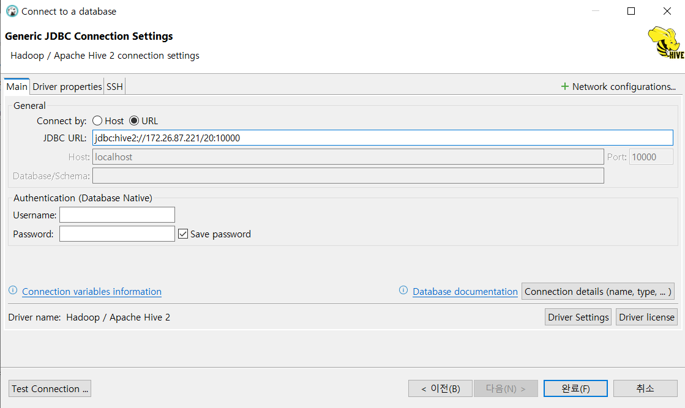
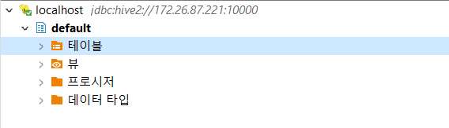

# [Hive](https://hive.apache.org/docs/latest/)
- SQL과 유사한 언어를 사용해 데이터를 처리할 수 있게 해주는 데이터 웨어하우스 시스템
- HDFS와 맵리듀스를 기반으로 개발됨
- MapReduce 자동 변환
- 대용량 분석에 적합

- **메타스토어(MetaStore)**
    - 하이브가 스키마를 저장하는 핵심 공간 => 스키마를 부를 때마다 
    - 스키마를 정의한다 -> 데이터의 규격을 정함

- **읽기 스키마**
    - 
    - 데이터를 읽을 때 비교

- **쓰기 스키마**
    - 데이터를 쓰고 저장할 때 사용
    - 저장된 데이터를 불러오는 과정에서 스키마가 맞는지 검증

---
---

# [Hive 설치](https://echo-edu.notion.site/install-1d082d1dd35f801883c7dacf7034ded1)
## 1. download & unzip
1.  Hive 검색 => Apache Hive 접속
- [설치링크](https://hive.apache.org/docs/latest/adminmanual-installation_27362077/)
2. Hive Releases
3.  archives
4. hive-3.1.3/
5. `apache-hive-3.1.3-bin.tar.gz` 링크 주소 복사\
6. 터미널로 Ubuntu 열고 `code .`입력해서 vscode 실행
7. 설치
```shell
wget https://archive.apache.org/dist/hive/hive-3.1.3/apache-hive-3.1.3-bin.tar.gz
```
8. 압축 풀기 : `tar`을 사용해서 unzip
```shell
tar -zxvf apache-hive-3.1.3-bin.tar.gz # 파일이름 탭으로 자동완성하기
# -xzvf의 순서는 옵션이기 때문에 상관없음
```
9. 폴더이름 `hive-3.1.3`으로 변경


## 2. 환경변수 등록
- `.bashrc`
```bashrc
export JAVA_HOME=/usr/lib/jvm/java-8-openjdk-amd64
export HADOOP_HOME=/home/ubuntu/hadoop-3.3.6
export HIVE_HOME=/home/ubuntu/hive-3.1.3 # 추가, 경로설정

export PATH=$PATH:$HADOOP_HOME/bin:$HIVE_HOME/bin # 추가, 명령어 추가
```
- `source ~/.bashrc` : `.bashrc` 파일 새로고침\
=> `source` : 내가 설정한 파일을 터미널에 적용시킨다는 의미\
=> 터미널이 새로 시작될 때는 `.bashrc`를 적용시킴\
=> 터미널 창이 켜진 채로 `.bashrc`파일을 수정하면 터미널창을 껐다 새로 키거나 새로고침 시켜야함

## 3. 메타 데이터 생성
- `cd hive-3.1.3/` : 위치 이동
- `schematool -dbType derby -initSchema`

## 4. safe 모드 해제(하둡이 실행중이어야함)
- `~/hadoop-3.3.6/sbin/start-all.sh ` : 하둡(hdfs, yarn) 실행 - `localhost:9870` 링크로 들어갈 수 있음
- `hdfs dfsadmin -safemode leave`

## 5. /temp/hive 디렉토리 생성
```shell
hdfs dfs -mkdir -p /tmp/hive
hdfs dfs -chmod +w /tmp/hive # group user한테 write(쓰기)권한을 주겠다 => 오류로 hive가 실행안돼서 전체한테 권한 주기
```

## 6. warehouse 디렉토리 생성
```shell
hdfs dfs -mkdir -p /user/hive/warehouse
hdfs dfs -chmod g+w /user/hive/warehouse
```

## 7. hive 실행 확인
- `hive`

# Hive Server
## 1. Hive Server 설정
- `hive-3.1.3/conf/hive-site.xml`파일 생성 : 서버 설정
```xml
<?xml version="1.0" encoding="UTF-8" standalone="no"?>
<?xml-stylesheet type="text/xsl" href="configuration.xsl"?>
<configuration>
    <property>
        <name>hive.server2.enable.doAs</name>
        <value>false</value>
    </property>
</configuration>
```

## 2. Hive Server 실행
- `hiveserver2 --hiveconf hive.server2.thrift.port=10000 --hiveconf hive.root.logger=DEBUG,console` : 서버 실행 -> 계속 띄워둘 것

## 3. 새로운 터미널(WSL) 생성 => `beeline`실행
```shell
beeline> !help
beeline> !connect jdbc:hive2://localhost:10000
# default user : scott
# default password : tiger
```

## beeline
- SQL코드를 작성하기 위한 공간
```shell
SHOW databases; # 우리가 사용 가능한 데이터베이스를 보여줌

SHOW tables; # 우리가 만든 테이블을 보여줌 -> 없으니까 아무것도 안뜸
```

---
---

# [HiveQL](https://echo-edu.notion.site/HiveQL-1d082d1dd35f8044a9b9c72a6a856921)
## 1. data download
- `cd damf2/data/` : 새로운 터미널(WSL)창 열어서 위치 이동
- `wget -O employees wget https://www.dropbox.com/scl/fi/v4ce4uz8jo82sr3yg792o/employees?rlkey=npfh5ok3pm0tr63kmtc3oayid&st=88bzfjo9&dl=0`

## 2. managed table(관리형 테이블)
- 데이터와 메타데이터 모두 데이터베이스가 관리

### 2-1. 테이블 생성 => beeline 터미널창
```sql
CREATE TABLE employees
(
    emp_no     INT,
    birth_date DATE,
    first_name STRING,
    last_name  STRING,
    gender     STRING,
    hire_date  DATE,
    dept_no    STRING
)
ROW FORMAT DELIMITED
FIELDS TERMINATED BY ','
LINES TERMINATED BY '\n';
```
- 테이블 확인
```shell
SHOW tables;
```

### 2-2. load data
```sql
LOAD DATA LOCAL INPATH '/home/ubuntu/damf2/data/employees'
INTO TABLE employees;
```
- 데이터 확인 => 10줄만 출력
```sql
SELECT * FROM employees LIMIT 10;
```
- 전체 데이터 갯수 확인
```sql
SELECT COUNT(*) FROM employees; => 맵리듀스 작업이 실행됨
```
- 생일이 같은 사람의 수 확인
```sql
SELECT birth_date, COUNT(birth_date)
FROM employees
GROUP BY birth_date
LIMIT 10;
```
- 테이블 삭제 => HDFS에 올라간 파일도 같이 삭제됨
```sql
DROP TABLE employees; -> 로컬은 지우지 않고 hdfs만 삭제
```

----
----

## 1. 서버 실행
- 하둡실행 -> 하이브 실행
- `~/hadoop-3.3.6/sbin/start-all.sh`
- `cd hive-3.1.3` -> `metastore.db`가 있는 위치에서 하이브를 실행해야함
- `hiveserver2 --hiveconf hive.server2.thrift.port=10000 --hiveconf hive.root.logger=DEBUG,console`
- 새로운 WSL터미널창 `beeline`(하이브 서버에 접근하기 위한 프로그램) -> `!connect jdbc:hive2://localhost:10000` -> scott, tiger


## 2. 데이터 업로드
- `input`폴더 안에 `employees`폴더 생성
```shell
hdfs dfs -mkdir /input/employees
```
- 하둡에 `employees.csv` 파일 업로드
```shell
hdfs dfs -put ~/damf2/data/employees /input/employees
```

## 3. external table(외부 테이블)
- 메타데이터만 데이터베이스가 관리, 데이터는 외부 경로에 존재
- 데이터를 먼저 업로드하고 테이블을 만듬 => 데이터와 테이블이 독립적

### 3-1. 테이블 생성
```sql
CREATE EXTERNAL TABLE employees
(
    emp_no     INT,
    birth_date DATE,
    first_name STRING,
    last_name  STRING,
    gender     STRING,
    hire_date  DATE,
    dept_no    STRING
)
ROW FORMAT DELIMITED
FIELDS TERMINATED BY ','
LINES TERMINATED BY '\n' 
STORED AS TEXTFILE
LOCATION '/input/employees';
```
- 데이터 확인
```sql
SELECT * FROM employees LIMIT 10;
```
- 테이블 삭제 => HDFS 안에는 파일 유지됨
```sql
DROP TABLE employees;
```

---
---

# 실습 - employees & department
## 1. data upload to HDFS
- data download
```shell
wget -O employees wget https://www.dropbox.com/scl/fi/v4ce4uz8jo82sr3yg792o/employees?rlkey=npfh5ok3pm0tr63kmtc3oayid&st=88bzfjo9&dl=0

wget -O departments wget https://www.dropbox.com/scl/fi/cz8tl4bdx1k8vsoysh4sy/departments?rlkey=9bkyioasjhhnts3iayzim3577&st=3v46kedt&dl=0
```
- 폴더 생성
```shell
hdfs dfs -mkdir /input/employees

hdfs dfs -mkdir /input/departments
```
- 하둡에 파일 업로드
```shell
hdfs dfs -put ~/damf2/data/employees /input/employees

hdfs dfs -put ~/damf2/data/departments /input/departments
```

## 2. [DBeaver](https://dbeaver.io/) 설치
### 2-1. download
- dbeaver 홈페이지 -> download -> Windows (Installer) -> For eveyone~ 선택 -> 설치

### 2-2. connect to hive
- `DBeaver` 실행 -> `Apache Hive 2` 더블클릭 -> `test Connection`설치하면 오류\
=> WSL을 사용하고 있기 때문에 linux에서 hive가 실행중이고 window에서 DBeaver를 통해 접속하려고 하기 때문에 localhost로 접근 불가능
- linux ip 확인
```shell
ip addr

# 결과 => 172.26.87.221로 접근
1: lo: <LOOPBACK,UP,LOWER_UP> mtu 65536 qdisc noqueue state UNKNOWN group default qlen 1000
    link/loopback 00:00:00:00:00:00 brd 00:00:00:00:00:00
    inet 127.0.0.1/8 scope host lo
       valid_lft forever preferred_lft forever
    inet6 ::1/128 scope host 
       valid_lft forever preferred_lft forever
2: eth0: <BROADCAST,MULTICAST,UP,LOWER_UP> mtu 1500 qdisc mq state UP group default qlen 1000
    link/ether 00:15:5d:ba:30:59 brd ff:ff:ff:ff:ff:ff
    inet 172.26.87.221/20 brd 172.26.95.255 scope global eth0
       valid_lft forever preferred_lft forever
    inet6 fe80::215:5dff:feba:3059/64 scope link 
       valid_lft forever preferred_lft forever
```
- dbeaver url 설정

- `test connection`다시 실행



## 3. 테이블 생성
- DBeaver script에서 실행
```sql
CREATE EXTERNAL TABLE employees
(
    emp_no     INT,
    birth_date DATE,
    first_name STRING,
    last_name  STRING,
    gender     STRING,
    hire_date  DATE,
    dept_no    STRING
)
ROW FORMAT DELIMITED
FIELDS TERMINATED BY ','
LINES TERMINATED BY '\n'
STORED AS TEXTFILE
LOCATION '/input/employees';

--

CREATE EXTERNAL TABLE departments
(
    dept_no STRING,
    dept_name STRING
)
ROW FORMAT DELIMITED
FIELDS TERMINATED BY ','
LINES TERMINATED BY '\n'
STORED AS TEXTFILE
LOCATION '/input/departments';
```
- 데이터 확인
```sql
SELECT * FROM employees LIMIT 10;
SELECT * FROM departments;
```

## 4. query example
### 4-1. employees 테이블에서 성별이 'M'인 사원들 조회, 입사일자 기준으로 정렬
```sql
SELECT * FROM employees
WHERE gender = 'M'
ORDER BY hire_date;
```

### 4-2. 생일이 4월인 사원 조회
```sql
--birth_date를 string으로
SELECT * FROM employees
WHERE birth_date LIKE '%-04-%'; --LIKE : 패턴을 매칭
--birth_date를 date타입으로
SELECT * FROM employees
WHERE MONTH(birth_date) = 4;
```

### 4-3. employees 테이블에서 나이가 가장 많은 사원 조회
```sql
SELECT MIN(birth_date) FROM employees; --맵리듀스 작업을 하기 때문에 시간이 걸림
--1952-02-01

SELECT * FROM employees
WHERE birth_date = (SELECT MIN(birth_date) FROM employees);
```

### 4-4. employees 테이블에서 부서별 사원 수 조회
```sql
SELECT dept_no, COUNT(*) FROM employees
GROUP BY dept_no;
```

### 4-5. - Development 부서의 사원 정보 조회 (join)
```sql
SELECT *
FROM employees JOIN departments
ON employees.dept_no = departments.dept_no
WHERE departments.dept_name = 'Development';

--축약
SELECT *
FROM employees e JOIN departments d 
ON e.dept_no = d.dept_no
WHERE d.dept_name = 'Development';
```

### 4-6. 부서별 사원 수 조회 (join)
```sql
SELECT d.dept_name, COUNT(e.emp_no)
FROM employees e JOIN departments d 
ON e.dept_no = d.dept_no
GROUP BY d.dept_name;
```

### 4-7. Sales 부서의 남녀 카운트
```sql
SELECT e.gender, COUNT(*)
FROM employees e JOIN departments d 
ON e.dept_no = d.dept_no
WHERE d.dept_name = 'Sales'
GROUP BY e.gender;

--CASE WHEN: if문과 같다고 생각
--CASE WHEN 조건식
SELECT 
	SUM(CASE WHEN e.gender = 'M' THEN 1 ELSE 0 END) AS M, --e.gender가 M이면 1, 아니면 0
	SUM(CASE WHEN e.gender = 'F' THEN 1 ELSE 0 END) AS F --e.gender가 F이면 1, 아니면 0
FROM employees e JOIN departments d 
ON e.dept_no = d.dept_no
WHERE d.dept_name ='Sales';
```